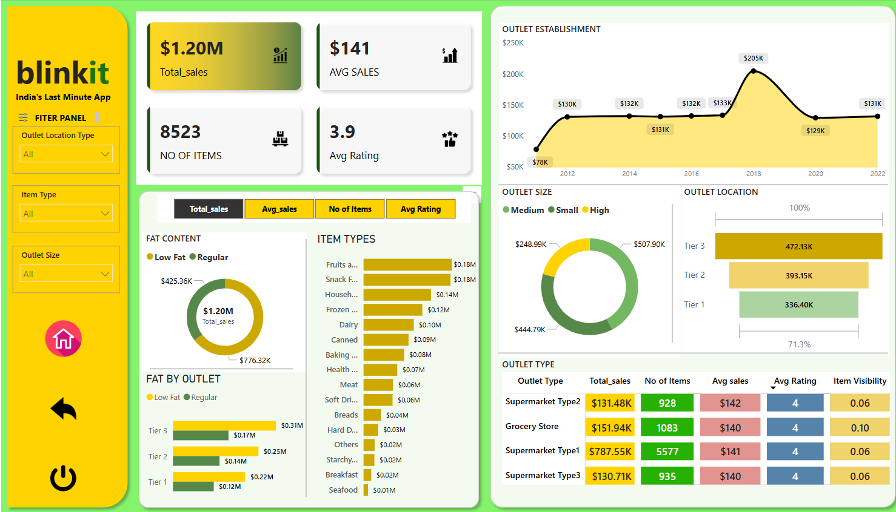

# Blinkit Grocery Sales Dashboard 📊

This Power BI project provides an analytical overview of Blinkit's online grocery delivery data.

## 📌 Project Description

The dashboard offers key business insights from a fictional Blinkit dataset, focusing on:
- Sales performance
- Delivery time analysis
- Product category contribution
- Order trends and customer behavior

## 📂 Dataset

File used: `BlinkIT Grocery Data.xlsx`  
Fields included:
- Order ID, Date
- Product Category
- Quantity, Unit Price
- Total Sales
- Delivery Time

## 💻 Tools Used

- **Power BI** – for interactive visualizations
- **Excel** – for raw data preparation
- **Power Query** – for data transformation
- **DAX** – for calculated measures

## 📈 Key Insights

- 📦 Top-selling categories and their revenue share
- ⏰ Peak sales hours and delivery delays
- 📊 Sales trend comparison by week/month
- 🔁 Repeat customer behavior

## 🎯 Skills Demonstrated

- Data Cleaning & Modeling
- DAX Measures (Sales, Delivery KPIs)
- Interactive Dashboard Design
- Business Insight Communication

---

Feel free to explore the project, fork the repository, or reach out for feedback!

  
